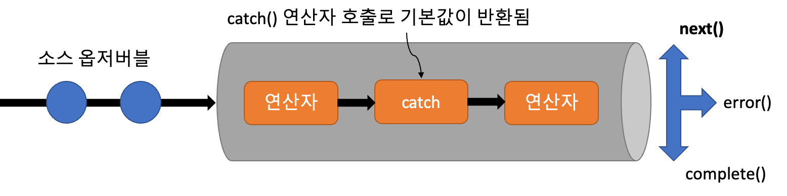

# RxJS의 에러처리💣

# 에러는 다양한 상황에서 발생하므로 항상 실패를 염려해둔 프로그래밍을 하자. ☹️

> 다양한 상황에서 발생하는 에러들

```jsx
new Array(-1); // RangeError: Invalid array length
console.log(foo); // ReferenceError: foo is not defined
fetch('https://nonexistent-domain.nowhere'); // TypeError: Failed to fetch
```

### 일반적인 에러 처리 기술

- try/catch 구문을 이용한 동기 코드의 예외처리

```jsx
try {
  console.log('에러가 나기 직전까지의 코드는 잘 실행됩니다.');
  new Array(-1); // RangeError: Invalid array length
  console.log('에러가 난 이후의 코드는 실행되지 않습니다.');
} catch (e) {
  console.log('코드의 실행 흐름이 catch 블록으로 옮겨집니다.');
  alert(`다음과 같은 에러가 발생했습니다: ${e.name}: ${e.message}`);
}
```

- try/catch with RxJS

```jsx
try {
  const data$ = Rx.Observable.fromPromise(ajax('/data')).subscribe(console.log);
} catch (e) {
  console.log(`Error processing stream : ${e.message}`);
}

// RxJS가 추구하는 순수함수성 위반
// 예외처리 구간마다 try/catch구문 사용으로 파이프라인 형식의 함수 구현이 어려움
```

- try/catch with 비동기 코드

```jsx
// (X)
try {
  setTimeout(() => {
    throw new Error('에러!');
  });
} catch (e) {
  console.error('에러발생');
}
// Uncaught Error: 에러!

// (O)
setTimeout(() => {
  try {
    throw new Error('에러!');
  } catch (e) {
    console.error('에러 잡아라');
  }
});
// 에러 잡아라
```

- 비동기식으로 작동하는 콜백의 내부에서 발생한 에러는, 콜백 바깥에 있는 `try` 블록으로는 잡아낼 수 없다.

    <aside>
    💡 JavaScript 엔진은 에러가 발생하는 순간 **호출 스택을 되감는 과정**을 거치는데, **이 과정 중에  `try` 블록을 만나야** 코드의 실행 흐름을 원상복구시킬 수 있다.
    비동기 콜백은 콜스택에 바로 쌓이는게 아닌 작업큐에서 대기 후에 콜스택이 비어진 후 실행이 되기 때문이다.
    
    </aside>

- Promise

```jsx
const p = new Promise((resolve) => {
  const even = parseInt(prompt('짝수를 입력하세요'));
  if (even % 2 !== 0) {
    throw new Error('짝수가 아닙니다.');
  } else {
    resolve(even);
  }
});

// then (onResolved, onRejected)
p.then(
  (even) => {
    return '짝수입니다.';
  },
  (e) => {
    consoe.error(e.message);
  }
);

// catch (onRejected)
p.then().catch((e) => {
  consoe.error(e.message);
});
```

- 비동기 함수 (async/await)

```jsx
async function func() {
  try {
    const res = await fetch('https://nonexistent-domain.nowhere');
  } catch (e) {
    console.log(e.message);
  }
}

func(); // Failed to fetch
```

- [예제7-2] ajax 콜백 지옥

```jsx
const ajax = function (url, success, error) {
  let req = new XMLHttpRequest();
  req.responseType = 'json';
  req.open('GET', url);
  req.onload = function () {
    if (req.status === 200) {
      let data = req.response;
      success(data);
    } else {
      req.onerror();
    }
  };
  req.onerror = function () {
    if (error) {
      error(new Error('IO Error'));
    }
  };
  req.send();
};

ajax(
  '/rest/api/data',
  (data) => {
    for (let item of data) {
      ajax(
        `/rest/api/data/${item.id}/info`,
        (dataInfo) => {
          ajax(`/rest/api/data/images/${dataInfo.img}`, showImage, (error) => {
            console.log(`Error image: ${error.message}`); // 가장 안쪽 에러 처리
          });
        },
        (error) => {
          console.log(`Error each data item: ${error.message}`); // 두번째 에러 처리
        }
      );
    }
  },
  (error) => {
    console.log(`Error fetching data: ${error.message}`); // 처음 호출 에러 처리
  }
);

function showImage(data) {
  console.log('successful');
}
```

<aside>
🤮 이대론 안돼... 이러다 다 죽어~~

</aside>

- [예제7-3] Promise

```jsx
const ajax = function (url) {
  return new Promise(function (resolve, reject) {
    let req = new XMLHttpRequest();
    req.responseType = 'json';
    req.open('GET', url);
    req.onload = function () {
      if (req.status == 200) {
        let data = req.response;
        resolve(data);
      } else {
        reject(new Error(req.statusText));
      }
    };
    req.onerror = function () {
      reject(new Error('IO Error'));
    };
    req.send();
  });
};

ajax('http://nowhere.com')
  .then(console.log)
  .catch((error) => console.log(`Error fetching data: ${error.message}`));
```

### 명령형 에러 처리와 함수형 및 반응형 코드 베이스 간의 비호환성

- 다른 함수형 산출물처럼 구성되거나 연결될 수 없다
- 예외 발생시 다른 반환 통로의 구성으로 인해 순수 함수 원칙을 위반한다.
- 예상하지 못한 스택 해제로 인해 사이드 이펙트 발생한다.
- 에러 복구에 사용된 코드는 호출 함수의 로컬 스택과 환경을 벗어난다.
- 특정 예외를 관리하기 위해 catch블록의 선언을 호출자에게 책임을 부여합니다.
- 비동기적으로 사용하기 어렵다.
- 여러 에러조건이 중첩된 예외 처리 블록을 사용하기 어렵다.

### 함수형 에러 처리 방식 이해하기

- Try - 함수형 데이터 타입 : 예외가 발생할 수 있는 코드를 래핑하여 예외처리를 통합하고 추상화 함

```jsx
class Try {
  constructor(val) {
    this._val = val;
  }

  static of(val) {
    if (val === null || val.constructor === Error || val instanceof Error) {
      return new Failure(val);
    }
    return new Success(val);
  }

  map(fn) {
    try {
      return Try.of(fn(this._val));
    } catch (e) {
      return Try.of(e);
    }
  }
}

class Success extends Try {
  getOrElse(anotherVal) {
    return this._val;
  }
}

class Failure extends Try {
  map(fn) {
    return this;
  }

  getOrElse(anotherVal) {
    return anotherVal;
  }
}

// Error case
let value = Try.of(new Error('Some error!'))
  .map((val) => val * val)
  .getOrElse(0);

console.log('Error case. Use default value: ' + value);

// Success case
value = Try.of(10)
  .map((val) => val * val)
  .getOrElse(0);

console.log('Success case. 10^2: ' + value);
```

- try/catch

```jsx
let record;
try {
  record = findRecordById('123');
  processRecord(record);
} catch {
  record = new Record('123', 'RecordA');
}
```

- Try

```jsx
let record = Try.of(() => findRecordById('123')
	.map(processRecord)
	.getOrElse(new Record('123', 'RecordA'));
```

- 변화의 전파와 함수의 매핑에 관한 논리가 Observable 데이터 타입과 동일하게 작동한다.

### RxJS의 실패 처리 방식

- 옵저버에 다운스트림으로 전파된 에러



발생한 에러는 옵저버에 전파되어 error()콜백이 호출된다.

- [예제7-5] 옵저버에서 error 메서드 호출하기

```jsx
const computeHalf = x => Math.floor(x / 2);

Rx.Observable.of(2,4,5,8,10)
   .map(num => {
      if(num % 2 !== 0) {
        throw new Error(`Unexpected odd number: ${num}`); // 에러 발생 로직
      }
      return num;
   })
   .map(computeHalf)
   .subscribe(
      function next(val) {
         console.log(val);
      },
      **function error(err) {
         console.log(`Caught: ${err}`); // 예외 핸들러
      },**
      function complete() {
         console.log('All done!');
      }
   );

// 예외가 발생하였기 때문에 전체 스트림이 취소되고 예외 핸들러의 console이 동작한다. 복구 불가능
// ”Caught: Error: Unexpected odd number : 5”
```

- 에러 포착과 반응

<aside>
💡 반응형 선언문
반응형 시스템의 주요 원칙 중 하나는 장애가 발생해도 시스템이 응답성을 유지해야 한다 는 유연성의 개념입니다. RxJS 연산자로 에러에 반응하는 것이 이 목표를 달성하는 한 방법입니다.

</aside>


- [예제 7-6] catch()로 예외 복구하기

```jsx
Rx.Observable.of(2,4,5,8,10)
   .map(num => {
      if(num % 2 !== 0) {
        throw new Error(`Unexpected odd number: ${num}`);
      }
      return num;
   })
   .catch(err => Rx.Observable.of(6)) // 에러를 포착하거나 가로채고 옵저버블 반환
   .map(n => n / 2)
   .subscribe(
      function next(val) {
         console.log(val);
      },
      function error(err) {
        console.log(`Received error: ${err}`);
      },
      function complete() {
         console.log('All done!');
      }

// 예외가 발생하여 이후 스트림이 취소되지만 복구는 가능하다.

// 1
// 2
// 3
// 'All done!'
```

- 일정 횟수 동안 실패한 스트림 재시도하기
  - 간헐적으로 발생하는 일부 에러의 커버를 위해 스트림의 중단을 막고 재시도 할 수 있다.
  - catch() 연산자에는 발생한 에러와 함께 소스 옵저버블로 채워진 Observable 시퀀스가 제공된다.
    
    무한히 재시도 한다...???
  - retry() 연산자 사용하기
  ```jsx
  Rx.Observable.of(2, 4, 5, 8, 10)
    .map((num) => {
      if (num % 2 !== 0) {
        throw new Error(`Unexpected odd number: ${num}`);
      }
      return num;
    })
    .retry(3) // 에러가 있으면 중단되고, 예외를 전파하기 전에 3번 반복한다.(총 4회)
    .catch((err$) => Rx.Observable.of(6)) // 에러를 전파하는 대신 기본값을 사용하게 함.
    .subscribe(
      function next(val) {
        console.log(val);
      },
      function error(err) {
        console.log(`Received error: ${err}`);
      },
      function complete() {
        console.log('All done!');
      }
    );
  ```
- 실패한 재시도에 반응하기

  - 서버과부하 없이 효과적으로 백오프 전략으로 재시도
  - retryWhen() 연산자로 연속적인 재시도 사이에 점진적으로 더 긴 대기시간을 사용한
    

  ```jsx
  const maxRetries = 3; // 최대 재시도 횟수 제한

  Rx.Observable.of(2, 4, 5, 8, 10)
    .map((num) => {
      if (num % 2 !== 0) {
        throw new Error(`Unexpected odd number: ${num}`);
      }
      return num;
    })
    .retryWhen((errors$) =>
      // scan()으로 누적된 간격마다 값을 방출한다
      errors$.scan((errorCount, err) => {
        if (errorCount >= maxRetries) {
          throw err;
        }
        return errorCount + 1;
      }, 0)
    )
    .subscribe(console.log);

  // 1
  // 2
  // 3초 지연
  // 1
  // 2
  // 3초 지연
  // ... maxRetries + 1 횟수 반복
  ```

  - zip() 연산자
    
    zip()은 스트림 이벤트가 발생하는 시간과 관계없이 각 인덱스에서 결합한다.

  ```jsx
  // zip() 연산자와 combineLatest() 연산자의 비교
  const s1$ = Rx.Observable.of(1, 2, 3, 4, 5, 6, 7, 8, 9);
  const s2$ = Rx.Observable.of('a', 'b', 'c', 'd', 'e');

  const s0$ = Rx.Observable.zip(s0$, s1$, s2$).subscribe(console.log);
  //  [1, "a"]
  // 	[2, "b"]
  // 	[3, "c"]
  // 	[4, "d"]
  // 	[5, "e"]

  Rx.Observable.combineLatest(s1$, s2$).subscribe(console.log);
  //  [9, "a"]
  // 	[9, "b"]
  // 	[9, "c"]
  // 	[9, "d"]
  // 	[9, "e"]
  ```

  - [예제 7-7] 선형 백오프 재시도 구현

  ```jsx
  const maxRetries = 3;

  Rx.Observable.of(2, 4, 5, 8, 10)
    .map((num) => {
      if (num % 2 !== 0) {
        throw new Error(`Unexpected odd number: ${num}`);
      }
      return num;
    })
    .retryWhen((errors$) =>
      Rx.Observable.range(0, maxRetries) //maxRetries만큼의 이벤트를 방출하는 옵저버블 객체 반환
        .zip(errors$, (val) => val) // 소스 옵저버블과 에러 옵저버블 결합
        .mergeMap(
          (
            i // 옵저버블 타이머와 map을 병합하여 백오프 전략 구현 0초1초.2초..
          ) =>
            Rx.Observable.timer(i * 1000).do(() =>
              console.log(`Retrying after ${i} second(s)...`)
            )
        )
    )
    .subscribe(console.log);
  ```

  - [예제 7-8] 일정 횟수, 선형 백오프, 에러가 지속되면 예외 발생시키기

  ```jsx
  const maxRetries = 3;

  Rx.Observable.of(2, 4, 5, 8, 10)
    .map((num) => {
      if (num % 2 !== 0) {
        throw new Error(`Unexpected odd number: ${num}`);
      }
      return num;
    })
    .retryWhen((errors$) =>
      Rx.Observable.range(0, maxRetries + 1)
        .zip(errors$, (i, err) => ({ i: i, err: err })) // 셀렉터 함수
        .mergeMap(
          (
            { i, err } // 인덱스와 에러 객체
          ) =>
            Rx.Observable.if(
              () => i <= maxRetries - 1,
              Rx.Observable.timer(i * 1000).do(() =>
                console.log(`Retrying after ${i} second(s)...`)
              ),
              Rx.Observable.throw(err)
            )
        )
    )
    .subscribe(console.log, (error) => console.log(error.message));
  ```

  - finally()로 미완료 스트림 정리하고 구독 취소하기
    

  4. twoSecond$ 옵저버블은 requestQuote$를 구독하고 있음
  5. requestQuote 스트림 함수에서 예외가 발생함
  6. catch() : 예외가 소스 스트림까지 전달되면 포착하고 옵저버에 전파함
  7. finally() : 구독 취소

  - [예제 7-9] 에러 처리를 하는 주식 시세 표시기

  ```jsx
  const requestQuote$ = (symbol) =>
    Rx.Observable.fromPromise(ajax(webservice.replace(/\$symbol/, symbol)))
      .map((response) => response.replace(/"/g, ''))
      .map(csv)
      .catch(() => Rx.Observable.of([new Error('Check again later...'), 0]))
      .finally(() => {
        updateSubscription.unsubscribe();
      });
  ```

- 명령형 에러 처리에는 FP와 호환되지 않는 많은 단점이 있다.
- Try 같은 값 컨테이너는 값을 불변으로 변환할 수 있는 유연하고 표현적인 메커니즘을 제공한다.
- Try 래퍼는 함수를 값에 순서대로 매핑할 수 있도록 예외 처리를 통합하고 추상화하는데 사용하는 함수형 데이터 타입이다.
- RxJS는 RxJS 스트림 선언의 선언적 특성과 스트림의 흐름을 손상하지 않는 방식으로 실패한 작업을 포착하고 재시도 할 수 있는, 유용하고 강력한 많은 연산자를 구현합니다.
- RxJS는 catch(), retry(), retryWhen(), finally()와 같은 연산자를 제공하며 이들을 결합하여 정교한 에러 처리 체계를 만들 수 있습니다.
